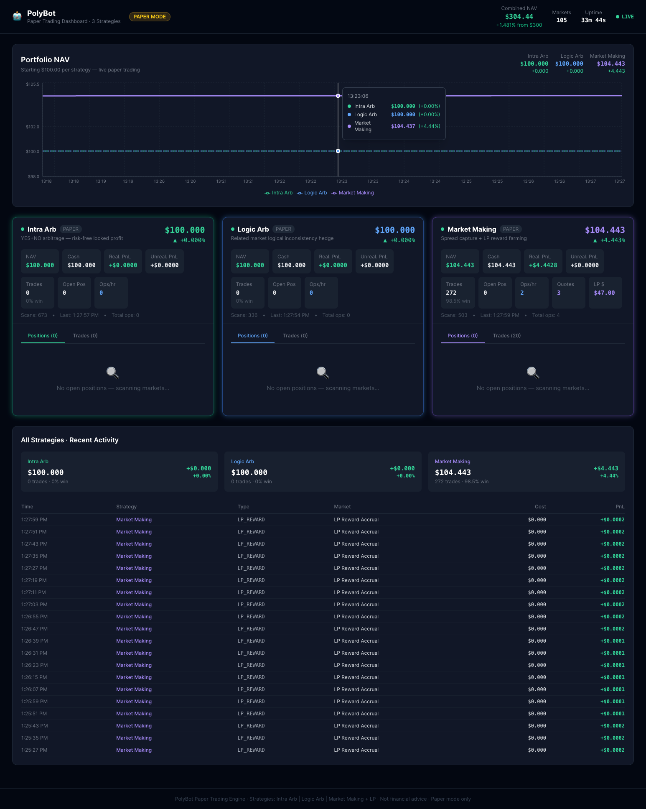

# ManageCloudVMs

A central repository for tracking, documenting, and managing personal cloud virtual machines across multiple providers. Contains VM profiles, SSH access references, service inventories, and operational notes.

> **Last updated: 2026-03-29** — OpenClaw + Moonshot V3 migrated from VM1 → VM2. VM1 shut down and retired.

---

## VM Inventory

| # | Name | Provider | Region | IP | OS | vCPU | RAM | Disk | Status |
|---|------|----------|--------|----|----|------|-----|------|--------|
| ~~VM1~~ | ~~`codebyte4googlevm05montreal`~~ | ~~Google Cloud (GCP)~~ | ~~Montréal, QC~~ | ~~`34.19.143.38`~~ | ~~Ubuntu 25.10~~ | ~~4~~ | ~~21 GB~~ | ~~66 GB~~ | **🔴 SHUT DOWN** |
| VM2 | `codebyte1-upcloud-ubuntu8cpu16gbNYC1` | UpCloud | New York City, US (NYC1) | `85.9.198.137` | Ubuntu 24.04.4 LTS | 8 (AMD EPYC 9575F) | 16 GB | 200 GB | **🟢 ACTIVE** |

**SSH Key:** `~/.ssh/google_compute_engine`

---

## Active VM — VM2 `codebyte1-upcloud-ubuntu8cpu16gbNYC1`

### Identity
| Field | Value |
|-------|-------|
| Hostname | `ubuntu-8cpu-16gb-us-nyc1` |
| Provider | UpCloud |
| Region | New York City, US (NYC1) |
| Public IP | `85.9.198.137` |
| Public IPv6 | `2605:7380:8000:1000:c0dd:8dff:fe08:45d7` |
| OS | Ubuntu 24.04.4 LTS (Noble Numbat) |

### Hardware
| Resource | Spec |
|----------|------|
| vCPUs | 8 (AMD EPYC 9575F) |
| RAM | 16 GB |
| Disk | 200 GB (`/dev/vda2`) |
| Swap | None |

### SSH Access
```bash
ssh -i ~/.ssh/google_compute_engine root@85.9.198.137
```

### Primary Purpose
**OpenClaw AI Agent Host.** VM2 is the sole active VM. It runs:
- **OpenClaw 2026.3.2** — autonomous AI agent gateway with 4 agents, connected to Telegram (`@blvckclawd_bot`)
- **Redis** — in-memory data store
- **Dashboard** — `http://85.9.198.137:18789/#token=5f21f0752c515b59bd9f15824236770b5fb9f5ae1281c28b`

### Running Services
| Service | Type | Description | Port |
|---------|------|-------------|------|
| `openclaw-gateway.service` | System systemd | OpenClaw AI Agent Gateway — 4 agents, Telegram `@blvckclawd_bot` | `0.0.0.0:18789` |
| ~~`moonshot-bot.service`~~ | ~~System systemd~~ | ~~Moonshot V3 (disabled)~~ | ~~`8000`~~ |
| `redis-server.service` | System systemd | In-memory key-value store (trading bot state) | `127.0.0.1:6379` |
| `xrdp` | System | Remote Desktop Protocol server | `3389` |
| `fail2ban` | System | SSH brute-force protection | — |
| `ssh` | System | OpenSSH server | `22` |

### OpenClaw Agents
| Agent | Identity | Model | Role |
|-------|----------|-------|------|
| `main` | 🐆 Black Panther | kilo/z-ai/glm-5-20260211 | Primary orchestrator — all user requests via Telegram |
| `researcher` | 🔭 Nova | kilo/z-ai/glm-5-20260211 | Deep research, news, fact-finding |
| `coder` | ⚡ Forge | kilo/z-ai/glm-5-20260211 | Code generation, GitHub ops, browser automation |
| `planner` | 🗺️ Atlas | kilo/z-ai/glm-5-20260211 | Planning, self-improvement, system health |

### Installed Skills (14 ready)
| Skill | Description |
|-------|-------------|
| `web-search` | Real-time web search |
| `news-summary` | Curated news briefs |
| `code-runner` | Execute Python/Node.js/bash snippets |
| `file-manager` | Read, write, search, manage server files |
| `system-monitor` | Server health — CPU, RAM, disk, services |
| `crypto-research` | CoinGecko market data, prices, trends |
| `summarize` | TL;DR summaries of URLs, text, documents |
| `self-improving-agent` | Review sessions, improve SOUL/MEMORY |
| `self-improving` | Proactive self-reflection and improvement |
| `xiucheng-self-improving-agent` | Cross-session pattern learning |
| `openclaw-github-assistant` | GitHub repository operations |
| `github-ops` | Advanced GitHub workflows |
| `browser-automation-stealth` | Headless browser automation |
| `github` | Basic GitHub operations |

### Runtime Stack
| Tool | Version |
|------|---------|
| Node.js | v22.22.0 |
| Python | 3.12.3 |
| OpenClaw | 2026.3.2 |
| Redis | 7.0.15 |
| npm | 10.9.4 |

### Key Paths
| Item | Path |
|------|------|
| OpenClaw config | `/home/codebytelabs4/.openclaw/openclaw.json` |
| Memory DB (SQLite) | `/home/codebytelabs4/.openclaw/memory/main.sqlite` |
| Workspace | `/home/codebytelabs4/.openclaw/workspace/` |
| Skills | `/home/codebytelabs4/.openclaw/workspace/skills/` |
| Moonshot bot | `/home/codebytelabs4/moonshot/` |
| Moonshot logs | `/home/codebytelabs4/moonshot/logs/` |
| OpenClaw env | `/home/codebytelabs4/myClawdbot/.env` |
| Dashboard URL | `http://85.9.198.137:18789/#token=5f21f0752c515b59bd9f15824236770b5fb9f5ae1281c28b` |

### System Users
| User | Purpose |
|------|---------|
| `root` | Admin / SSH access |
| `codebytelabs4` | OpenClaw + Moonshot runtime user |
| `codebyte1` | Desktop session user |

---

## Retired VM — VM1 `codebyte4googlevm05montreal` (Shut Down 2026-03-29)

> VM1 was a Google Cloud Platform VM in Montréal running OpenClaw and Moonshot V3.
> All workloads migrated to VM2 on 2026-03-29. VM1 was shut down to eliminate GCP billing.
> **Action required:** Delete VM1 in GCP Console to stop billing entirely.

| Field | Value |
|-------|-------|
| Provider | Google Cloud Platform (GCP) |
| Region | Montréal, QC (`northamerica-northeast1`) |
| IP (when active) | `34.19.143.38` |
| OS | Ubuntu 25.10 |
| vCPUs | 4 (AMD EPYC 7B13) |
| RAM | 21 GB |
| OpenClaw version | 2026.1.30 (at retirement) |
| Backup | `openclaw_migration_20260329.tar.gz` (712MB) taken before shutdown |
| GCP auto-restart | Disabled (`--no-restart-on-failure`) |
| Stop command | `gcloud compute instances stop codebyte4googlevm05montreal --zone=northamerica-northeast1-a --project=project-7e939169-7c3e-4ca6-81a` |

---

## SSH Quick Reference

```bash
# VM2 — UpCloud NYC1 (OpenClaw + Moonshot — ACTIVE)
ssh -i ~/.ssh/google_compute_engine root@85.9.198.137

# Run health check on VM2
ssh -i ~/.ssh/google_compute_engine root@85.9.198.137 \
  "sudo -u codebytelabs4 bash -c 'export HOME=/home/codebytelabs4; \
   export PATH=/home/codebytelabs4/.npm-global/bin:/usr/bin:/bin; openclaw health'"

# Check Moonshot API
ssh -i ~/.ssh/google_compute_engine root@85.9.198.137 \
  "curl -s http://localhost:8000/health"
```

---

## Health Checklist (VM2)

| Check | Status |
|-------|--------|
| SSH reachable | ✅ |
| Disk usage safe (<80%) | ✅ ~5% used |
| OpenClaw gateway running | ✅ port 18789 (public `0.0.0.0`) |
| Telegram bot connected | ✅ `@blvckclawd_bot` |
| All 4 agents active | ✅ main, researcher, coder, planner |
| Moonshot bot | 🔴 Disabled (archived) |
| Redis running | ✅ port 6379 |
| fail2ban active | ✅ |
| Services auto-restart on reboot | ✅ (linger + systemd) |

---

## Documentation

| Document | Description |
|----------|-------------|
| [`OPENCLAW.md`](./OPENCLAW.md) | Complete OpenClaw reference — architecture, config, memory, skills, agents, API |
| [`MIGRATION_LOG.md`](./MIGRATION_LOG.md) | Step-by-step VM1 → VM2 migration log with commands and verification |

---

## Recommendations

- **Delete VM1 on GCP Console** — shut down but still incurring storage costs. [console.cloud.google.com](https://console.cloud.google.com)
- **Add swap on VM2** — no swap configured; add 4GB for stability under memory pressure.
- **Restrict Moonshot API port** — port 8000 binds to `0.0.0.0`; restrict to `127.0.0.1` if external access not needed.
- **Schedule nightly backups** on VM2 — add cron to back up `.openclaw` and `moonshot` directories.
- **Rotate gateway token** — the token was in use on VM1 before retirement; consider rotating via `openclaw config set`.

---

*Last updated: 2026-03-29 — Post-migration state*
